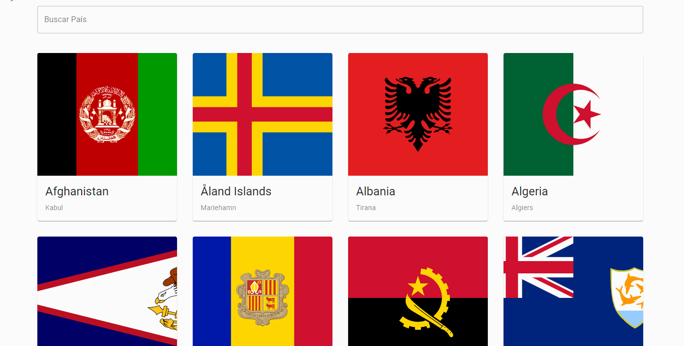

<h1 align="center"> 🚀 <a target="_blank" href=https://countries-react-eta.vercel.app> Demonstração </a></h1>


## 🔖 Sobre

Este projeto foi desenvolvido para praticar consumo de apis e gerenciamento de estado com Redux utilizando o framework React.

Foi utilizado a api [Rest Countries](https://restcountries.eu/#rest-countries)

---

## 🗂 Como executar o projeto

### Pré requisitos

Antes de começar, você vai precisar ter instalado em sua máquina as seguintes ferramentas:
[Git](https://git-scm.com) e [Node.js](https://nodejs.org/en/).
Além disto é bom ter um editor para trabalhar com o código como o [VSCode](https://code.visualstudio.com/)

### 🎲 Executando a aplicação

```bash
    # Clone o repositório
    $ git clone https://github.com/renatogual/countries-react.git

    # Entre no diretório da aplicação
    $ cd countries-react

    # Instale as dependências
    $ npm install

    # Inicie o website
    npm start
```

---

## 🛠 Ferramentas utilizadas

- **[React](https://reactjs.org)**
- **[Redux](https://redux.js.org/)**
- **[Redux-toolkit](https://redux-toolkit.js.org/)**
- **[Axios](https://github.com/axios/axios)**
- **[Material-UI](https://material-ui.com/pt/)**

---

## ☑️ Features

- [x] Listar países
- [x] Página com detalhes de cada país
- [X] Busca de países pelo nome
- [X] Editar dados de um país
- [ ] Salvar a edição dos dados no client-side
- [ ] Paginação para listar todos os países
- [ ] Implementar testes unitários
